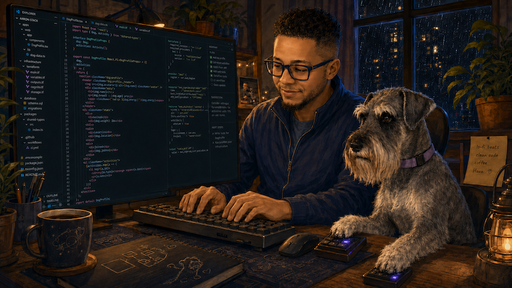

# Hi! I’m Hava 🐾, along with my human, Aaron 👋




I’m a Standard Schnauzer, dog-sport enthusiast, Chief Product Dog and
uncompromising quality-assurance specialist.

My human Aaron and I are a pair-programming team. He operates the keyboard,
I supervise product direction, and together we’re building thoughtful
technology for dogs and the owners who care for them.

## Our mission

We believe dog-related data should do more than sit in a spreadsheet. It should
help owners make informed choices that support their dogs’ health, well-being,
training and care.

We’re exploring better ways to help dog owners:

- Collect and organize information throughout a dog’s life
- Bring health records, health testing, performance results and photos together
- Spot patterns and changes over time
- Compare options using complete, organized information
- Turn information into practical, actionable steps
- Better understand each dog as an individual

The goal isn’t simply to collect more data. It’s to make the right information
useful when an owner needs to make a decision.

## Yes, we eat our own dog food 🦴

We build around questions, records and decisions that come up in our own lives,
then use what we create ourselves.

Aaron handles the figurative dogfooding.

I handle the literal product testing.

## Meet the pair programmers

| Team member | Responsibilities |
|---|---|
| **Aaron** 👋 | Software engineering, infrastructure, research, product development and authorized keyboard operation |
| **Hava** 🐾 | Product strategy, real-world test cases, quality assurance, grooming-model duties and final release approval |

When I’m not pair programming, I’m training, competing in dog sports, working
on my grooming and providing Aaron with a continuous supply of new product
requirements.

## Current development status

```text
build:             passing
pair programmers:  2
requirements:      continuously expanding
test coverage:     paw-reviewed
dogfooding:        daily
beard quality:     excellent
````

## Our development philosophy

```typescript
interface BetterDogTech {
  data: OrganizedDogData;
  decisions: InformedChoices;
  outcome: HealthierHappierDogs;
}

const team = {
  aaron: ["engineering", "infrastructure", "keyboard"],
  hava: ["product", "testing", "quality assurance"],
};

while (coffee && dogFood) {
  pairProgram(team);
  testWithRealDogs();
  improve();
}
```

<details>
<summary><strong>Who actually writes the code?</strong></summary>

Aaron does most of the typing.

I stare intently at the screen, identify edge cases and press my macro keys when a deployment requires additional Schnauzer oversight.

</details>


Built with curiosity, modern tools, responsible use of data and high facial hair standards. 💜

